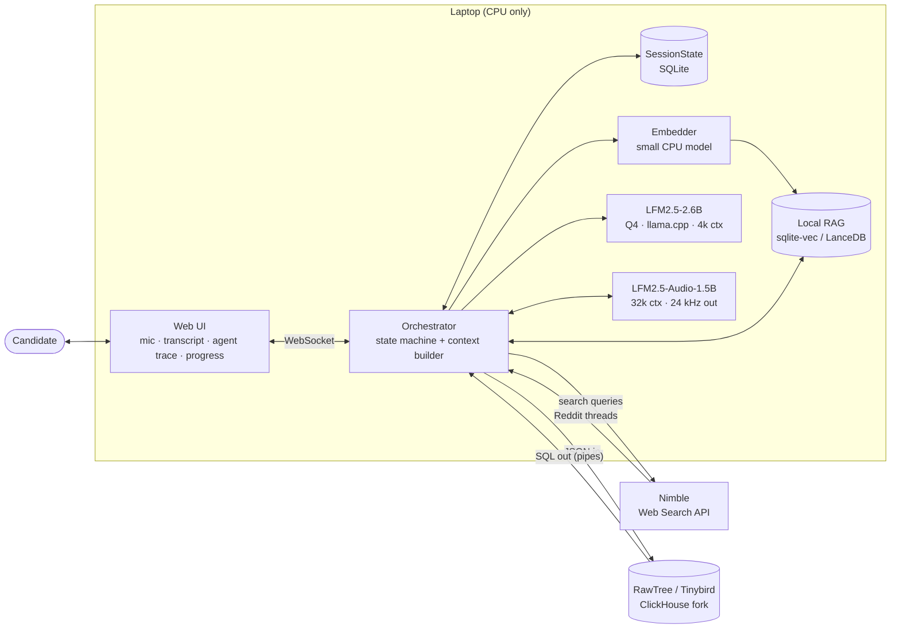
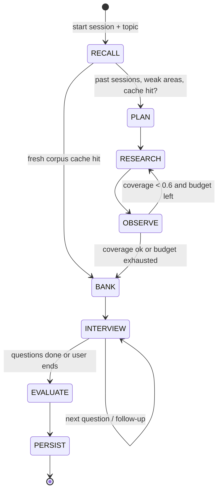
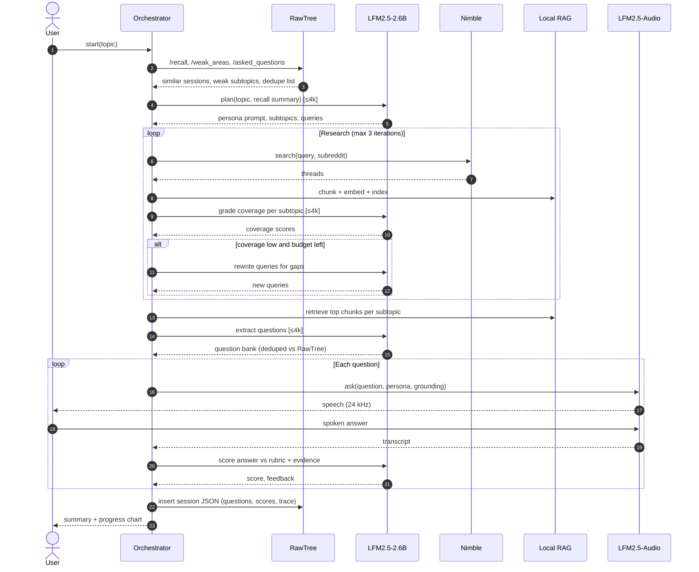
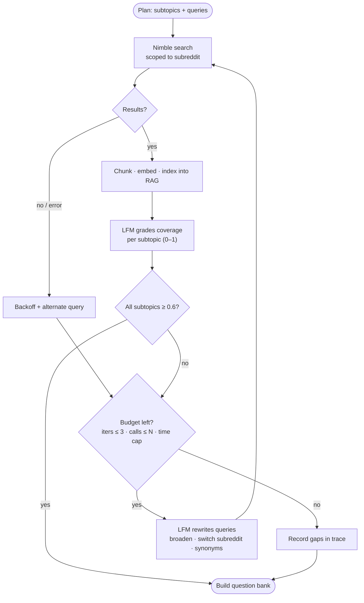
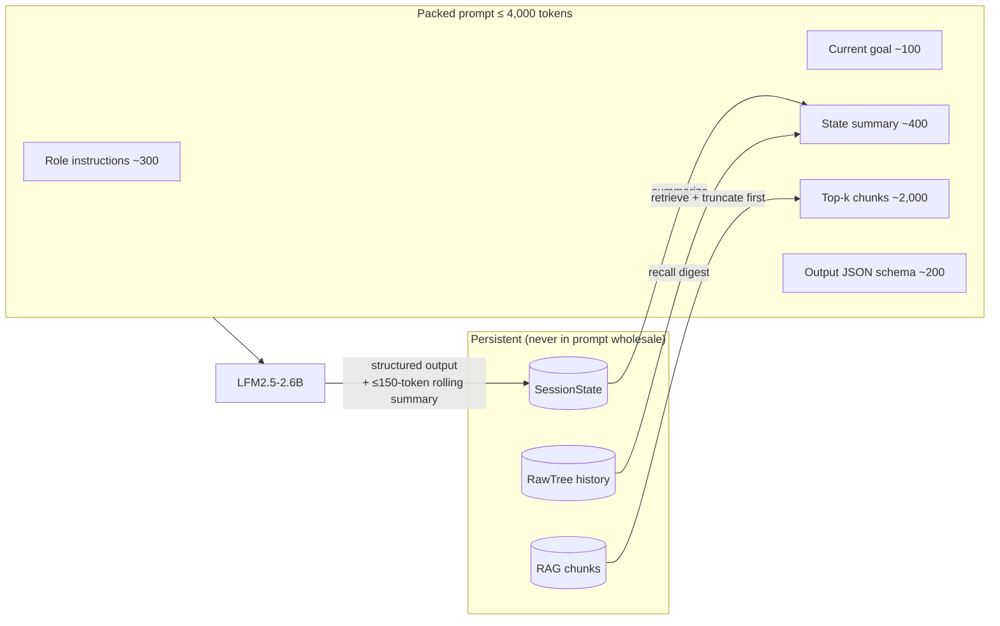
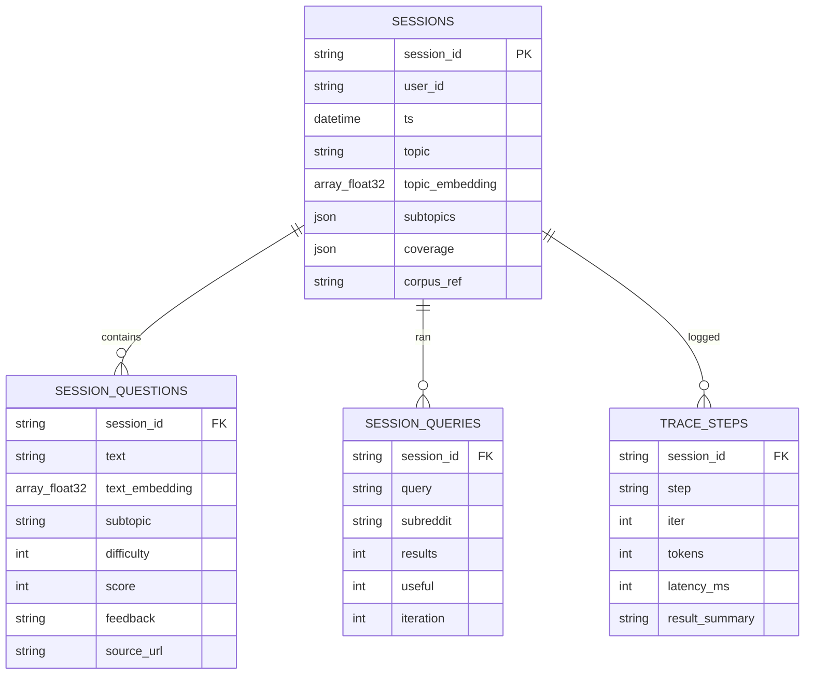
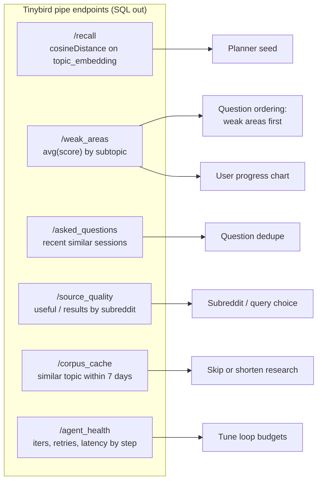

# ADR 0001: Architecture for the On-Device Interview Prep Agent

- **Status:** Proposed
- **Date:** 2026-09-25
- **Deciders:** Deeraj Gurram and the hackathon team
- **Context:** Long Horizon Agents Hackathon. The agent must plan, act, observe, and self-correct across a full cycle without drowning in its own history, and it must use 3+ sponsor tools.
- **Related:** [PLAN.md](../../PLAN.md)

---

## Context

We are building a mock interviewer that runs on a laptop CPU. The user starts a session and names a topic. The agent does the rest on its own:

1. It researches what real candidates report being asked, using live Reddit data.
2. It builds a grounded question bank.
3. It runs a spoken interview, scores it, and remembers the results for the next session.

Constraints that shape the design:

| Constraint | Source |
|---|---|
| Planner model has a **4k-token** input context (LFM2.5-2.6B, 4-bit, CPU, a few GB of RAM) | Liquid AI model limits |
| Audio model has a 32k context and 24 kHz output (LFM2.5-Audio-1.5B) | Liquid AI model limits |
| Web research is the slowest phase of the session | Nimble search plus thread fetch latency |
| Must show autonomy on live web data with no manual steps | Judging: Autonomy |
| Must use ≥3 sponsor tools meaningfully | Judging: Tool Use |
| Demo must fit in 3 minutes | Judging: Presentation |

## Decision

1. **Orchestration:** a Python orchestrator driven by an explicit **state machine**, not a free-form chat agent loop.
2. **Memory model:** **state, not history.** Every step reads and writes a structured `SessionState` in SQLite. Each LFM prompt is freshly packed to ≤4k tokens. Raw web content lives only in the local RAG store.
3. **Sponsor tool roles:**
   - **Nimble**: live web search scoped to interview subreddits.
   - **Liquid AI**: LFM2.5-2.6B handles planning, grading, and evaluation. LFM2.5-Audio-1.5B runs the voice interview.
   - **RawTree (Tinybird)**: long-term cross-session memory and analytics, with JSON in and SQL out exposed as Tinybird pipe endpoints.
4. **Self-correction:** a coverage-graded research loop with hard budgets (iterations, API calls, wall clock).
5. **Local RAG:** `sqlite-vec` or LanceDB plus a small CPU embedder. It is file-based and needs no server.

---

## Diagrams

### System context

### Session state machine

### End-to-end session sequence

### Self-correcting research loop

### Per-step context packing (≤4k tokens)

### RawTree data model

### How analytics feed back into the agent

---

## Options considered

| Option | Pros | Cons | Verdict |
|---|---|---|---|
| **A. State machine + external state (chosen)** | Fits in 4k context, deterministic, easy to trace and demo, directly shows the "without drowning in history" requirement | More upfront schema design | ✅ |
| B. Free-form ReAct loop with chat history | Fast to prototype | Overflows 4k within a few steps, hard to debug, weak self-correction story | ❌ |
| C. Cloud LLM for planning, local only for audio | Bigger context, better reasoning | Breaks the on-device premise and the Liquid AI story, and adds latency and cost | ❌ |
| D. Store everything in RawTree, including the RAG corpus | One store | Network round trip per retrieval, and RawTree is analytics-oriented rather than a low-latency vector store | ❌ (RawTree keeps summaries and embeddings of sessions only) |

## Consequences

**Positive**
- The context budget is enforced by construction, so long sessions don't degrade.
- Every step is traced, which makes the agent's autonomy visible in the demo and queryable in RawTree.
- Cross-session memory makes each session better targeted, and a corpus-cache hit removes the slowest phase.

**Negative / risks**
- The small planner model may produce malformed JSON. Mitigation: schema-constrained decoding, a retry, then a deterministic fallback.
- Audio model latency on CPU is not yet known. Mitigation: warm-load the model and keep a text + system TTS fallback.
- RawTree's support for JSON types and `cosineDistance` needs to be verified. Fallback: `Array(Float32)` columns with similarity computed locally.
- Nimble's Reddit coverage and latency still need a day-1 spike. Mitigation: cache results for demo topics.

## Follow-ups

- [ ] Spike Nimble, LFM2.5-2.6B Q4, LFM2.5-Audio, and RawTree. Record latency for each.
- [ ] Freeze the `SessionState` and RawTree schemas.
- [ ] Write ADR 0002 on the RAG store choice (sqlite-vec vs LanceDB) after the spikes.
