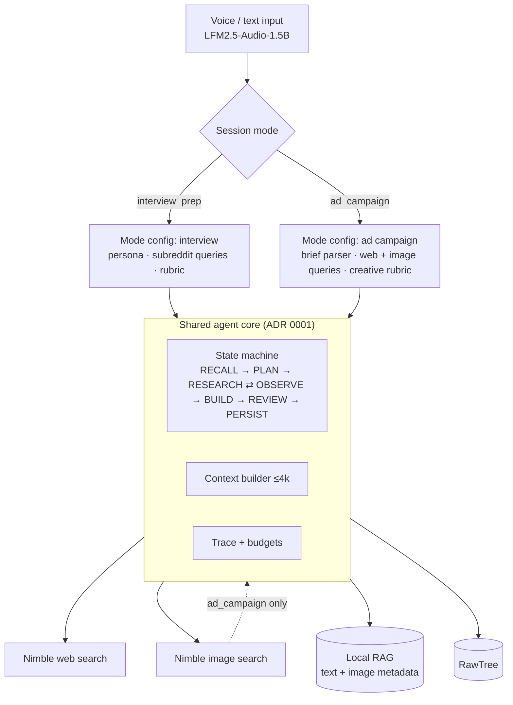
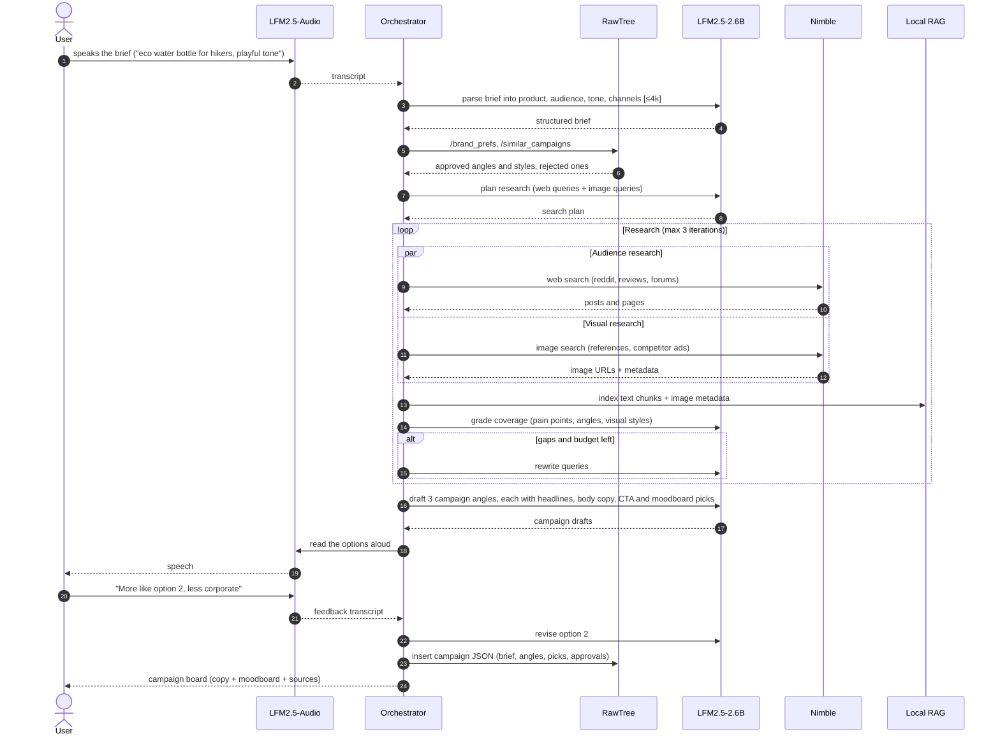
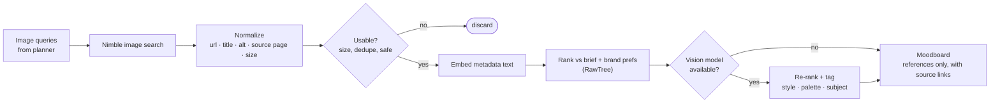
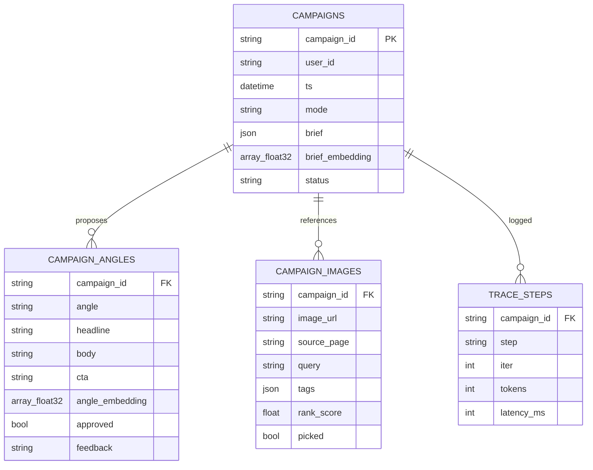

# ADR 0002: Ad Campaign Mode Using Nimble Image Search

- **Status:** Proposed
- **Date:** 2026-09-25
- **Deciders:** Deeraj Gurram and the hackathon team
- **Builds on:** [ADR 0001](0001-interview-prep-agent-architecture.md)

---

## Context

Nimble can search the web for images as well as text. That opens a second use for the same on-device agent: the user **speaks a product or campaign brief**, and the agent researches the audience and the visual landscape, then drafts an ad campaign.

The agent loop from ADR 0001 is not specific to interviews. It runs recall → plan → research ⇄ observe → build → review with the user → persist. Only the prompts, the search types and the final artifact change.

Constraints specific to this mode:

| Constraint | Implication |
|---|---|
| LFM2.5-2.6B is text-only | It cannot judge an image by looking at it. We rank images using their metadata (title, alt text, source page, dimensions) unless we add a vision model. |
| Images found on the web are not licensed for reuse | Found images serve as **references and a moodboard only**, never as final ad creative. |
| The stack has no image generator | The output is copy, a creative brief and a moodboard. Final visuals are a stretch goal or a handoff. |
| The demo lasts 3 minutes | Showing both modes in full is too much. See Decision 5. |

## Decision

1. **Generalize the orchestrator into "session modes".** Each mode is a config: `{planner_prompt, search_plan_schema, coverage_rubric, builder, reviewer, persist_schema}`. The state machine, context packing, budgets and trace are shared with no changes.
2. **Add an `ad_campaign` mode** with two kinds of research:
   - **Nimble web search** on Reddit, reviews and forums to find audience pain points, the words customers use and competitor claims.
   - **Nimble image search** to collect visual references, competitor ads and brand-adjacent aesthetics.
3. **Rank images from metadata by default.** An optional vision model (for example LFM2-VL, *not yet verified*) can re-rank the top candidates and tag them with style, color and subject.
4. **Store campaigns in RawTree** so we can see which angles, styles and audiences the user approves or rejects. Each future campaign then starts from those preferences.
5. **Demo plan:** interview prep stays the primary demo. Ad campaign is a stretch goal, shown for about 20 seconds as "same agent, different mode". This keeps the demo focused while showing that the architecture is general.

---

## Diagrams

### One agent core, two modes

### Ad campaign session sequence

### Image research and selection pipeline

### RawTree additions for campaigns

### How campaign analytics feed back

| Pipe endpoint | SQL idea | How the agent uses it |
|---|---|---|
| `/brand_prefs` | approval rate by angle type and image tag, per user | Favors approved tones and styles and avoids rejected ones |
| `/similar_campaigns` | `cosineDistance(brief_embedding, {new})` | Reuses research and angles from similar past briefs |
| `/image_query_yield` | `picked / returned` by query pattern | Improves future image queries |
| `/angle_performance` | approval rate by angle and audience | Orders the options it proposes |

---

## Options considered

| Option | Pros | Cons | Verdict |
|---|---|---|---|
| **A. Mode config on the shared core (chosen)** | Reuses all of ADR 0001, and a second mode shows the architecture is general | Mode configs need a stable interface early | ✅ |
| B. Pivot entirely to ad campaigns | Visual demo, and a clear commercial story | Throws away the interview design, and image selection is weak without a vision model | ❌ for now; revisit if the team prefers |
| C. A separate app for campaigns | Independent development | Duplicate orchestration, and two half-finished demos | ❌ |
| D. Use found images directly as ad creative | Looks finished | Copyright and licensing risk | ❌ |

## Consequences

**Positive**
- Nimble is used for two search types, which strengthens the Tool Use criterion.
- The "same agent, new mode" story supports the Idea and Technical Implementation criteria.
- RawTree preference learning carries over across modes.

**Negative / risks**
- Without a vision model, image ranking relies on metadata, which may be noisy. Mitigation: show source links, let the user pick, and log picks to RawTree.
- Scope creep. Mitigation: build this mode only after ADR 0001 milestones 1–3 work end to end.
- Licensing. Mitigation: the moodboard is labeled "references" and always links to sources.

## Follow-ups

- [ ] Verify Nimble's image search endpoint: parameters, metadata returned, rate limits.
- [ ] Decide whether to add a vision model (for example LFM2-VL). Check RAM headroom next to the other two models.
- [ ] Define the `ModeConfig` interface in the orchestrator before milestone 2.
- [ ] Team decision: keep ad campaign as a stretch mode, or pivot to it (Option B).
