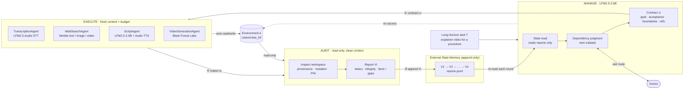
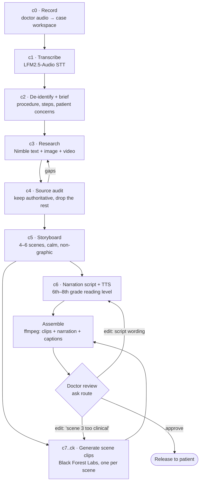
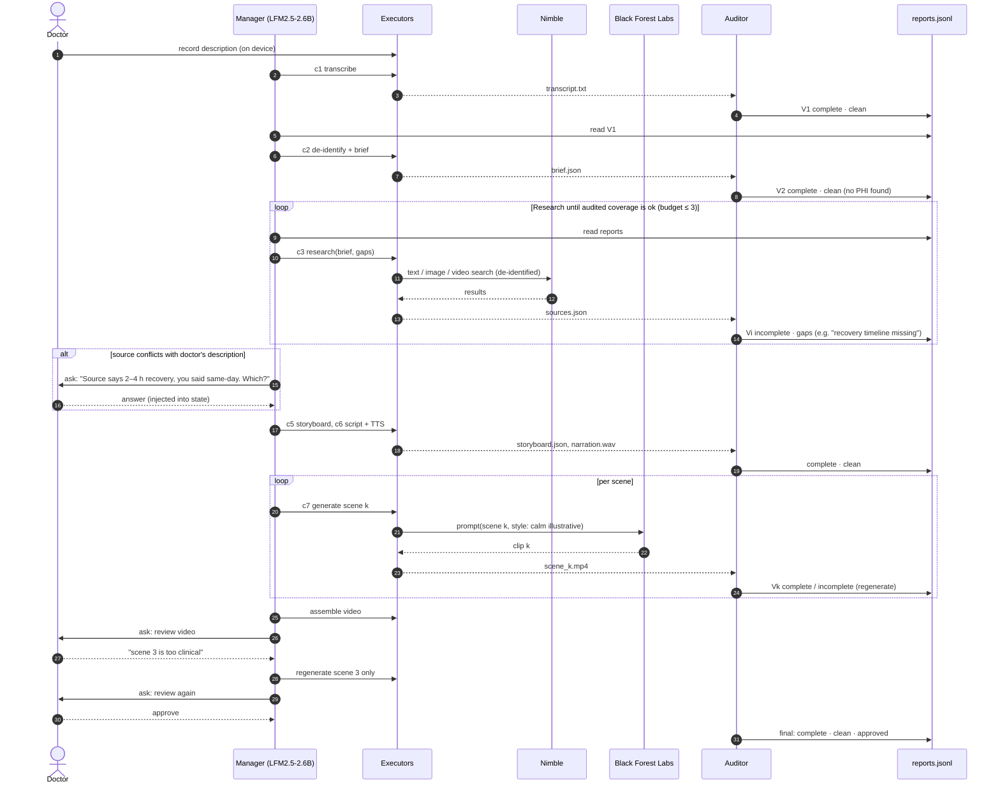
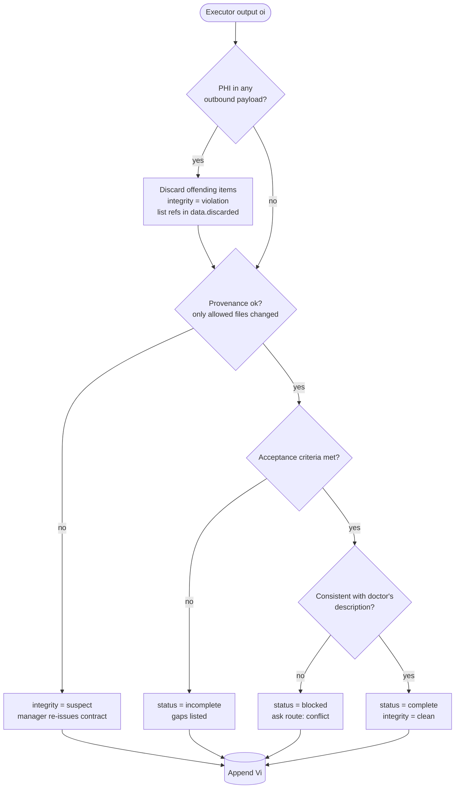
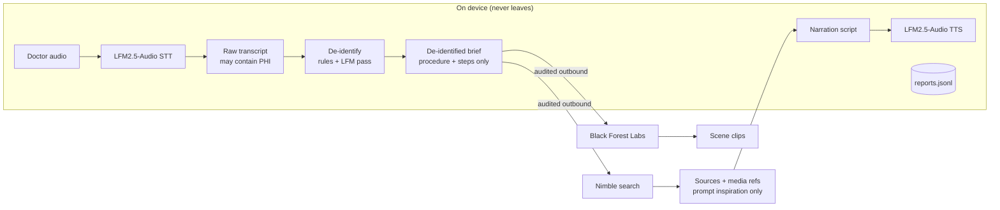
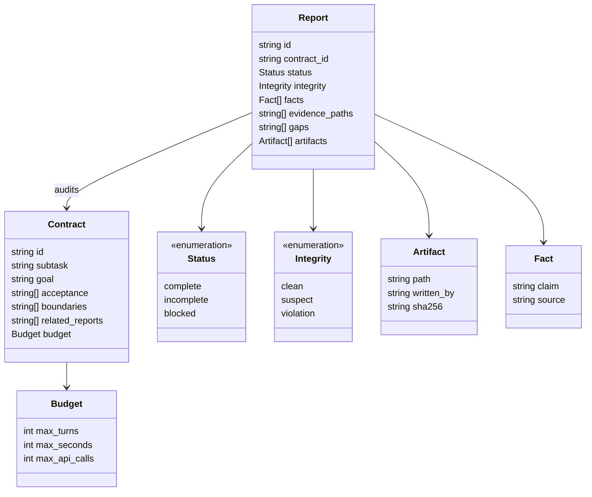

# ADR 0003: Procedure Explainer Video Agent on a Manage-Execute-Audit Harness

- **Status:** Proposed
- **Date:** 2026-09-25
- **Deciders:** Deeraj Gurram and the hackathon team
- **Relation to earlier ADRs:** This is a different use case from [0001](0001-interview-prep-agent-architecture.md) and [0002](0002-ad-campaign-mode-with-nimble-image-search.md). It reuses their core ideas: on-device LFM models, external state instead of chat history, and budgeted self-correction. It replaces their state machine with a **Manage-Execute-Audit** harness.

---

## Context

Patients are often nervous before a procedure, and a verbal explanation from a doctor is hard to picture. We want a doctor to **describe a procedure out loud** and have the agent produce a **short, calm, patient-friendly explainer video**. The doctor reviews and approves the video before any patient sees it.

The pipeline the team proposed:

| Step | Agent | Tool |
|---|---|---|
| 0 | Recorder | OSS audio capture (Python `sounddevice` + `soundfile`, or browser `MediaRecorder`) |
| 1 | TranscriptionAgent | Liquid AI **LFM2.5-Audio-1.5B** (speech-to-text) |
| 2 | ManagerAgent (long-running) | Liquid AI **LFM2.5-2.6B** (Q4, CPU, 4k context) |
| 3 | WebSearchAgent | **Nimble**: text, image and video search |
| 4 | AuditAgent | Independent review; discards irrelevant sources and triggers a re-search |
| 5 | VideoGenerationAgent | **Black Forest Labs**; the doctor can request edits |

This is a long-horizon task. It runs through many searches, audits, scene generations and edit rounds. The 4k-token manager would drown if it carried the full trajectory. The LongHorizon-Harness pattern (Manage → Execute → Audit, with an append-only external state memory of audit reports) solves this directly, and it is what the hackathon asks for.

### Constraints specific to healthcare

| Constraint | Implication |
|---|---|
| The recording may contain **PHI** (patient name, DOB, MRN, history) | Transcription runs on device. Only a **de-identified procedure description** may leave the device for Nimble or BFL. Any PHI in an outbound request or a returned source is an audit **violation**: the Auditor discards the offending item and the case continues (see [ADR 0004](0004-manager-agent-rule-based-scheduler.md)). |
| The video is patient education, **not medical advice** | The doctor's description is the source of truth. Web sources may only *enrich* it, never *contradict* it. Conflicts go back to the doctor. |
| Generated video can show wrong anatomy or be distressing | The style is calm, illustrative and non-graphic. **The doctor must approve before release** (a hard gate). |
| Source quality matters | Prefer authoritative sources (MedlinePlus, NHS, Mayo Clinic, specialty societies, hospital patient-education pages). Discard forums and marketing pages. |
| Web images and videos are not licensed for reuse | Nimble media results are **references for prompt writing only**. They never go into the output. |

## Decision

1. **Adopt the Manage-Execute-Audit harness.**
   - The **Manager** (LFM2.5-2.6B) is a state machine. It sees only the task and the audit reports V₁…Vᵢ, never the raw environment. Each round it emits one **subtask contract** cᵢ = {goal, acceptance criteria, boundaries, related report refs}. It can also take the **ask** route to the doctor.
   - The **Executors** (Transcription, WebSearch, VideoGeneration) run each contract in a **fresh, budgeted context**. They see the environment and the related reports only, and their trajectories are discarded.
   - The **Auditor** runs read-only in a clean context. It inspects the workspace and returns report Vᵢ with `status ∈ {complete, incomplete, blocked}`, `integrity ∈ {clean, suspect, violation}`, and `state_update = {facts, evidence, gaps}`.
   - **External State Memory:** reports are appended to `reports.jsonl`. They are the *only* thing the Manager reads, so memory grows by one report per round rather than with the trajectory.
   - **Terminate** when every subtask has status `complete`, integrity is `clean`, and the doctor has approved.
2. **Environment = a per-case workspace folder** (`cases/<case_id>/`): audio, transcript, de-identified brief, sources, storyboard, scene clips, final video. The Auditor checks artifact provenance (which executor wrote each file) and flags unexpected mutations or deletions.
3. **Decompose the video into scenes** (about 4–6, for example *before you arrive → check-in and prep → anesthesia → the procedure, shown non-graphically → recovery → going home*). Each scene is its own subtask contract. Edits regenerate a single scene, not the whole video.
4. **Build narration on device.** LFM2.5-2.6B writes a script at a 6th–8th grade reading level, and LFM2.5-Audio-1.5B voices it. The final video is BFL scene clips plus narration, stitched with `ffmpeg`.
5. **Put a PHI boundary at the device edge.** A de-identification step (rules for names, dates and IDs, followed by an LFM pass) produces the only text that may leave. The Auditor re-checks every outbound payload.
6. **Use the ask route (human in the loop) for:** conflicts between the doctor's description and the sources, `blocked` subtasks, and the **final approval gate**. Edit requests come back in by voice and are transcribed on device.
7. **Sponsor tools:** Liquid AI (two models), Nimble, Black Forest Labs. That makes 3. An optional 4th is **RawTree/Tinybird**, used as a queryable mirror of the report log and for analytics across cases (reuse audited sources and storyboards for the same procedure type).

---

## Diagrams

### Harness overview

### Subtask plan (one contract per node)

### End-to-end sequence

### Audit decision

### Privacy boundary

### Report schema (Vᵢ)

---

## Context budget (Manager ≤ 4k tokens)

The Manager never reads transcripts, sources or clips. It reads only a digest of reports:

| Slot | ~Tokens |
|---|---|
| Role + harness rules | 400 |
| Task T + de-identified brief | 400 |
| Task state Sᵢ (subtasks with status) | 300 |
| Latest reports (full) plus older reports (one line each) | 1,800 |
| Pending doctor answers | 200 |
| Contract JSON schema | 300 |

Executors get contract cᵢ plus the related reports only. Their step history is thrown away once they return oᵢ, following "dozens of steps → 1 report".

---

## Options considered

| Option | Pros | Cons | Verdict |
|---|---|---|---|
| **A. Manage-Execute-Audit harness (chosen)** | Bounded context, independent verification, a natural human gate, matches the hackathon theme and the published pattern | More moving parts than a linear pipeline | ✅ |
| B. Linear pipeline, steps 0 → 5 | Simplest to build | No self-correction and no audit trail; one bad source poisons the video | ❌ |
| C. Single agent with a growing transcript | Few components | Overflows 4k within a few rounds; the executor judges its own work | ❌ |
| D. Use Nimble-found images and videos directly in the output | Realistic visuals | Licensing risk, and some are graphic | ❌ references only |

## Consequences

**Positive**
- The raw transcript never leaves the device, and every outbound payload is audited for PHI.
- Every claim in the video traces back to a report, and every report traces back to evidence files. That gives the doctor an audit trail to review.
- Scene-level contracts make doctor edits cheap and targeted.

**Negative / risks**

| Risk | Mitigation |
|---|---|
| BFL's video capability or API access is unconfirmed | **Spike on day 1.** Fallback: BFL image generation (FLUX) for keyframes per scene, animated with `ffmpeg` (Ken Burns pans, crossfades) and narrated |
| The Auditor can't "see" clips (LFM2.5-2.6B is text-only) | Audit scene prompts and metadata. Optionally caption sampled frames with a vision model (for example LFM2-VL, *unverified*). The doctor gate is the final visual check. |
| De-identification misses something | Rules first, LFM second, Auditor third. The demo uses a synthetic, non-patient recording only. |
| Generated anatomy is inaccurate or distressing | Illustrative, non-graphic style constraints in every prompt, plus the doctor approval gate |
| STT errors on medical terms | Show the transcript to the doctor for a quick fix. Keep a medical-term glossary in the brief. |
| Nimble media search parameters or coverage are unknown | Spike on day 1. Text-only research is enough for scripting. |

## Build order

| # | Milestone | Done when |
|---|---|---|
| 0 | Spikes | Mic capture → LFM2.5-Audio STT. LFM2.5-2.6B emits a contract under a JSON schema. Nimble text and image search. BFL generates one clip or image. Record latency for each. |
| 1 | Harness skeleton | Manager / Executor / Auditor loop over `reports.jsonl`, with stub executors and termination logic |
| 2 | Text path | Record → transcript → de-identified brief → Nimble research with an audit-driven re-search → storyboard + script |
| 3 | Media path | BFL scene generation, TTS narration, `ffmpeg` assembly |
| 4 | Doctor loop | Review UI, voice edit → single-scene regeneration, approval gate |
| 5 | Demo hardening | Synthetic case, cached Nimble results, pre-generated fallback clips, trace panel |

**Cut line:** keep the audit loop and the doctor gate. They are the core of the Autonomy, Technical and safety story. If BFL video is unavailable or slow, drop to the keyframe fallback.

## Demo script (3 min)

1. **0:00–0:20** Problem: patients are anxious before procedures, and a verbal explanation is hard to picture.
2. **0:20–0:45** The doctor records about 20 seconds: "We'll do a colonoscopy under light sedation…"
3. **0:45–1:40** The trace panel streams the rounds: contract → Nimble research → an audit drops a forum source and flags a missing recovery timeline → re-search → storyboard. The Manager's context stays flat while the report log grows.
4. **1:40–2:30** The video plays. The doctor says "scene 3 is too clinical", only scene 3 regenerates, and the doctor approves.
5. **2:30–3:00** Architecture: Manage-Execute-Audit, the PHI boundary, and the sponsor tools.

## Follow-ups

- [ ] Confirm Black Forest Labs video generation access; otherwise commit to the keyframe fallback.
- [ ] Confirm Nimble image and video search parameters.
- [ ] Confirm LFM2.5-Audio-1.5B's STT input format (sample rate, max clip length) and TTS voices.
- [ ] Decide whether to add RawTree as a 4th sponsor tool (report mirror + a cross-case source cache).
- [ ] Mark ADR 0001 and 0002 as *Superseded* if the team commits to this use case.
