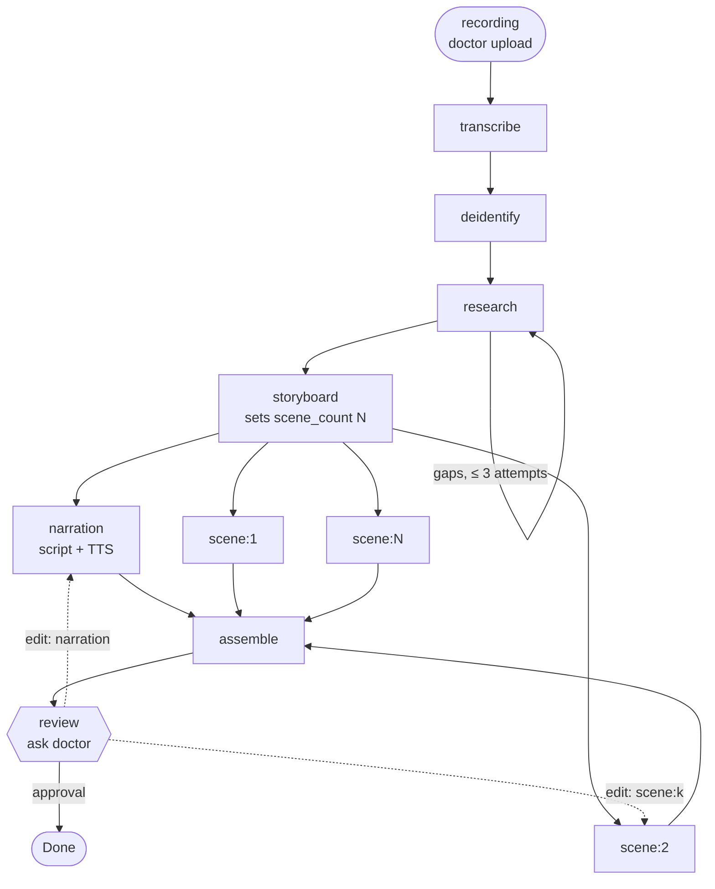
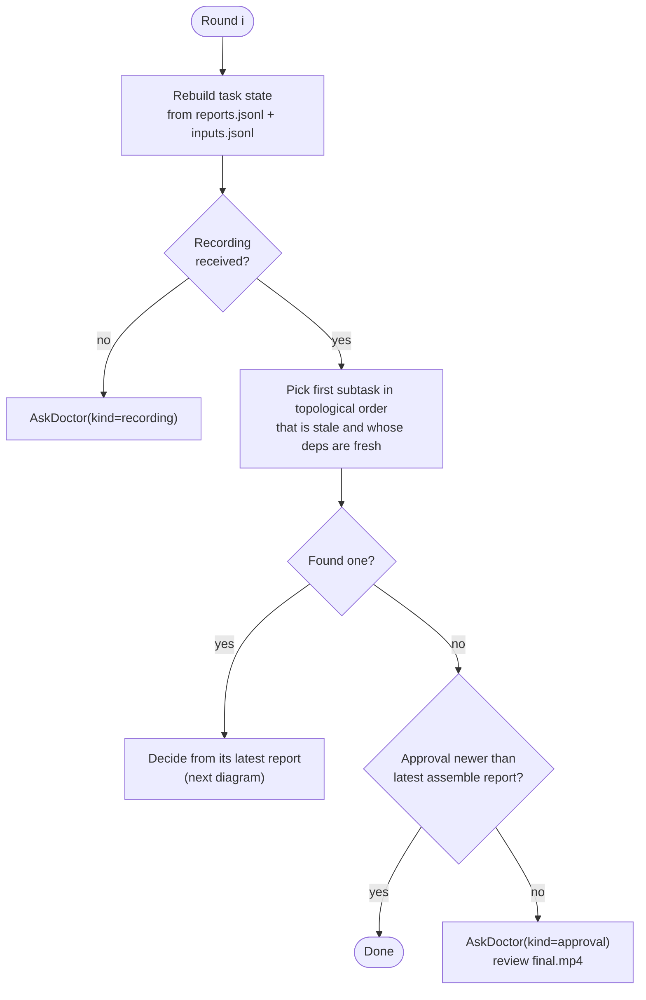
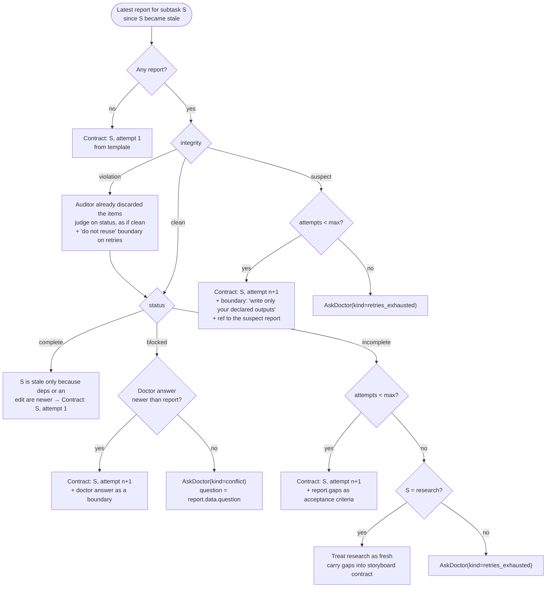
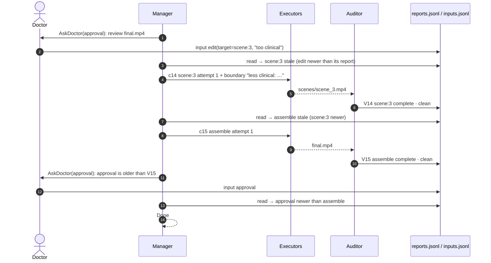

# ADR 0004: ManagerAgent as a Rule-Based Scheduler over the Report Log

- **Status:** Proposed
- **Date:** 2026-09-25
- **Deciders:** Deeraj Gurram and the hackathon team
- **Relation to earlier ADRs:** Implements the **Manage** step of [ADR 0003](0003-procedure-explainer-video-agent.md) for build milestone 1 (harness skeleton). The LFM2.5-2.6B Manager described in ADR 0003 becomes a later layer on top of this one (see [Later: where the LFM fits](#later-where-the-lfm-fits)).

---

## Context

ADR 0003 describes a Manager that reads only audit reports, decides the next subtask and emits a contract cᵢ. To get the Manage → Execute → Audit loop running end to end before the LFM spike lands, we need a Manager that:

- is **deterministic**, so the loop can be tested with stub executors and a stub Auditor;
- respects the harness rules: it **never reads the workspace**, only reports and doctor inputs;
- handles every audit outcome (`complete`, `incomplete`, `blocked` × `clean`, `suspect`, `violation`);
- handles doctor input: the initial recording, answers to questions, edit requests and final approval;
- regenerates only what an edit or a changed upstream result actually affects.

## Decision

1. **The Manager is a pure function** of the task, the report log and the doctor-input log:
   `next_step(reports, inputs, round_no) -> Contract | AskDoctor | Done`.
   It holds no state of its own. Every round it rebuilds the task state from the logs, so a crash or restart loses nothing.
2. **Subtasks form a fixed dependency graph** (below). The Manager picks the **first subtask in topological order that is not fresh but whose dependencies are all fresh**, and issues one contract for it. It issues one contract per round; scene clips could run in parallel later.
3. **Freshness replaces explicit invalidation.** A subtask is *fresh* when its latest report is `complete` + `clean` **and** that report is newer than its dependencies' fresh reports **and** newer than any doctor input that targets it. When an upstream result changes, or the doctor asks for an edit, everything downstream goes stale automatically, and only that part is regenerated.
4. **A PHI violation discards the source, not the case.** The Auditor removes the offending item (a source, a media reference, a prompt) and lists it by reference in `state_update.data["discarded"]`, never by content. The report's `status` then decides the next step as usual, and discarded items are listed as "do not reuse" on later attempts. Nothing halts and nothing else is recomputed.
5. **The latest report decides the retry**, following the decision flow below. Retries are capped per subtask. Research that runs out of attempts proceeds with its gaps recorded; any other subtask that runs out of attempts goes to the doctor.
6. **Doctor inputs live in a separate append-only log**, `inputs.jsonl`, in the case folder. This refines ADR 0003's "reports only" rule: the Manager reads reports **and** doctor inputs, and still never reads the workspace.
7. **Edits carry an explicit target** (`scene:3`, `narration`, `storyboard`) in milestone 1. The review UI makes the doctor pick the target. Parsing free-text edits ("scene 3 is too clinical") into a target is later LFM work.

---

## Substeps

| # | Subtask key | Executor | Depends on | Produces (workspace) | Max attempts |
|---|---|---|---|---|---|
| 0 | `recording` | *(doctor, via upload)* | none | `audio/recording.wav` | n/a |
| 1 | `transcribe` | `transcription` | `recording` | `transcript.txt` | 2 |
| 2 | `deidentify` | `deidentify` | `transcribe` | `brief.json` | 2 |
| 3 | `research` | `web_search` | `deidentify` | `sources.json`, `media_refs.json` | 3 (`max_research_iterations`) |
| 4 | `storyboard` | `script` | `research` | `storyboard.json` | 2 |
| 5 | `narration` | `script` | `storyboard` | `script.txt`, `narration.wav` | 2 |
| 6…k | `scene:1` … `scene:N` | `video_generation` | `storyboard` | `scenes/scene_<n>.mp4` | 2 each |
| k+1 | `assemble` | `assembly` | `narration`, all `scene:n` | `final.mp4` | 2 |
| k+2 | `review` | *(doctor, ask route)* | `assemble` | approval input | n/a |

`N` comes from the latest fresh `storyboard` report, `state_update.data["scene_count"]`. If a new storyboard changes `N`, the scene set follows it.

ADR 0003 lists "source audit" (c4) as its own step. Here it is the Auditor's review of the `research` output: dropped sources and missing topics come back as `gaps` on the research report, and those gaps drive the re-search.

### Dependency graph

---

## Round algorithm

### When a report comes back

This is the core of the Manager. It looks at the latest report for the picked subtask since the subtask last became stale, and decides what to do next:

A doctor answer newer than the latest report also allows one more attempt after `retries_exhausted`.

### Report outcome → Manager decision

| Latest report for S | Attempts left | Manager emits |
|---|---|---|
| none | n/a | `Contract(S, attempt=1)` from the template |
| `complete` · `clean`, but stale | n/a | `Contract(S, attempt=1)`: an upstream result or an edit changed |
| `incomplete` · `clean` | yes | `Contract(S, attempt=n+1)`, with the report's `gaps` added to acceptance criteria |
| `incomplete` · `clean` | no, S = `research` | none for S; research counts as fresh, and its gaps go into the `storyboard` contract |
| `incomplete` · `clean` | no, other S | `AskDoctor(kind=retries_exhausted)` |
| `blocked` · `clean`, no newer answer | n/a | `AskDoctor(kind=conflict, question=report.data["question"])` |
| `blocked` · `clean`, newer answer | n/a | `Contract(S, attempt=n+1)`, with the answer added as a boundary |
| any · `suspect` | yes | `Contract(S, attempt=n+1)` with a tightened write boundary |
| any · `suspect` | no | `AskDoctor(kind=retries_exhausted)` |
| any · `violation` | n/a | Same as the row for its `status` with `clean`. The Auditor has already discarded the offending items; they are listed in a "Discarded for PHI, do not reuse" boundary on every later attempt. Other subtasks keep running. |

### Doctor inputs

| Input `kind` | Target | Effect |
|---|---|---|
| `recording` | none | Satisfies `recording`. A new recording makes everything stale, so the whole case re-runs. |
| `answer` | the subtask that asked | Resolves a `blocked` report, or allows one more attempt after `retries_exhausted`. The subtask is reissued with the answer as a boundary. |
| `edit` | `scene:n`, `narration` or `storyboard` | Makes the target stale, which also makes `assemble` stale and forces a new review. The edit text becomes a boundary on the next contract. |
| `approval` | none | Counts only if newer than the latest fresh `assemble` report. Then the Manager returns `Done`. |

### Edit round example

---

## Resulting contracts

Every contract has `id = c<round:02d>-<subtask>-a<attempt>` (for example `c07-scene-2-a1`). Its `related_reports` are the IDs of the fresh reports of its direct dependencies. On retries it also includes the report that caused the retry.

| Subtask | Goal | Acceptance criteria | Boundaries |
|---|---|---|---|
| `transcribe` | Transcribe the doctor's recording on device. | `transcript.txt` exists and is non-empty. The report sets `data.duration_s`. | On device only; no network calls. Write only `transcript.txt`. |
| `deidentify` | Produce a de-identified procedure brief from the transcript. | `brief.json` has `procedure`, `steps[]` and `patient_concerns[]`. No names, dates, MRNs or other identifiers. | On device only. Read `transcript.txt`; write only `brief.json`. |
| `research` | Research the procedure for patient education, using the brief. | `sources.json` has ≥ 3 authoritative sources covering prep, procedure, recovery and going home. On retries: every listed gap is covered. | Outbound queries built from `brief.json` only. Forums and marketing pages are excluded. Media results are references only. Web sources must not contradict the brief. |
| `storyboard` | Break the procedure into 4–6 calm, non-graphic scenes. | `storyboard.json` has 4–6 scenes, each with a title, description and visual prompt. The report sets `data.scene_count`. | The doctor's brief is the source of truth. Do not cover research gaps (listed) with invented content. |
| `narration` | Write and voice the narration script. | `script.txt` is at a 6th–8th grade reading level, with one section per scene. `narration.wav` exists. | TTS runs on device. Follows `storyboard.json`. Doctor edits are listed as boundaries. |
| `scene:n` | Generate the clip for scene *n*. | `scenes/scene_<n>.mp4` exists and matches the scene's visual prompt. | Calm, illustrative, non-graphic style. The prompt is de-identified. Write only `scenes/scene_<n>.mp4`. Doctor edits are listed as boundaries. |
| `assemble` | Stitch the scene clips, narration and captions. | `final.mp4` exists, has N scenes in order, and its audio length matches the narration. | Local `ffmpeg` only. Write only `final.mp4`. |

Retry additions, applied on top of the template:

- **incomplete:** each gap `g` becomes an acceptance criterion: "Resolve: g".
- **blocked + answer:** a boundary "Doctor answered: …".
- **suspect:** a boundary "Write only your declared outputs; a previous attempt modified other files".
- **violation:** a boundary "Discarded for PHI, do not reuse: ref₁, ref₂…", built from every `data.discarded` since the subtask went stale.
- **edit:** a boundary "Doctor edit: …".

Research that finishes with gaps adds a boundary to `storyboard`: "Research gaps (do not invent content): g₁, g₂…".

---

## Schema changes

These go into [state/schemas.py](../../backend/app/state/schemas.py) with the implementation:

| Model | Change | Why |
|---|---|---|
| `Contract` | add `subtask: str` (the key, e.g. `scene:3`), `attempt: int` | The Manager has to map reports back to subtasks and count attempts |
| `Report` | add `subtask: str`, copied from the contract by the Auditor | Same reason; the Manager never parses IDs |
| `StateUpdate` | add `data: dict[str, Any]` | Structured values the Manager needs: `scene_count`, `question`, `duration_s`, `discarded` |
| new `DoctorInput` | `id`, `kind ∈ {recording, answer, edit, approval}`, `target: str \| None`, `text: str \| None`, `created_at` | Stored in `inputs.jsonl` |
| `AskDoctor` | add `kind ∈ {recording, conflict, retries_exhausted, approval}` and `subtask: str \| None` | Lets the UI render the right prompt |

`ManagerAgent.next_step` becomes `next_step(reports, inputs, round_no)`. The loop passes the round number so contract IDs are stable. The task description isn't needed by the rules; it returns when the LFM layer is added.

---

## Options considered

| Option | Pros | Cons | Verdict |
|---|---|---|---|
| **A. Rule-based scheduler over a dependency graph, with freshness (chosen)** | Deterministic and testable; restarts safely; edits regenerate only what they affect | Judgment calls (whether a gap matters, which scene an edit means) are fixed rules | ✅ for milestone 1 |
| B. LFM decides the next step from the start | Closest to ADR 0003 | Blocked on the LFM spike; hard to test; a 2.6B model will pick invalid next steps | ❌ for now; layered on later |
| C. Hard-coded linear pipeline in `loop.py` | Fastest to write | No retries, no edits, ignores reports, and nothing the LFM can later plug into | ❌ |
| D. Explicit invalidation (mark downstream dirty on change) | Familiar | Stores extra mutable state; easy to miss a dependency | ❌; freshness gets the same result from timestamps |

## Consequences

**Positive**
- The Manager is a pure function, so a test is just a list of reports and inputs in and an expected decision out.
- Context stays flat. The Manager reads only the latest report per subtask, plus attempt counts.
- The edit loop, retries and the approval gate all fall out of one freshness rule.

**Negative / risks**

| Risk | Mitigation |
|---|---|
| Ordering relies on `created_at` timestamps across two logs | All writes go through one process. Use a monotonic `seq` if clock issues appear. |
| One contract per round makes scene generation serial | Acceptable for the demo. Scenes are independent, so they can be batched later. |
| Fixed retry caps may be too tight or too loose | Caps come from `config.py`. |
| Edits need an explicit target in milestone 1 | The review UI provides scene buttons; free-text targeting comes with the LFM. |

## Later: where the LFM fits

The rules remain the skeleton and the fallback. LFM2.5-2.6B is called only at specific decision points, under a JSON schema:

- **Incomplete research:** decide whether a gap is worth another search or can be accepted.
- **Edit parsing:** map free-text edits to a target subtask.
- **Conflict questions:** write the question for the doctor from the report's facts.
- **Contract wording:** rewrite template goals using the brief.

If the model's output fails schema validation, the Manager falls back to the rule.

## Build order

| # | Step | Done when |
|---|---|---|
| 1 | Schema changes plus `inputs.jsonl` log | Models validate; round-trip tests pass |
| 2 | Freshness and task-state builder | Unit tests over hand-built logs |
| 3 | `next_step` decision logic and contract templates | One test per row of the outcome table |
| 4 | Loop wiring with stub executors and a stub Auditor | One case runs from recording to `AskDoctor(approval)`, then to `Done` after approval |
| 5 | Edit, conflict and violation scenarios | Scenario tests: an edit on `scene:3` regenerates only scene 3 plus assemble |

## Follow-ups

- [ ] Decide whether `recording` should also create an intake report, so the trace panel shows it as round 0.
- [ ] Confirm the scene count range (4–6) with the team.
- [ ] Decide the failure behaviour when the storyboard changes `N` after scenes were generated. Proposed: orphaned scene files are ignored by `assemble`.
