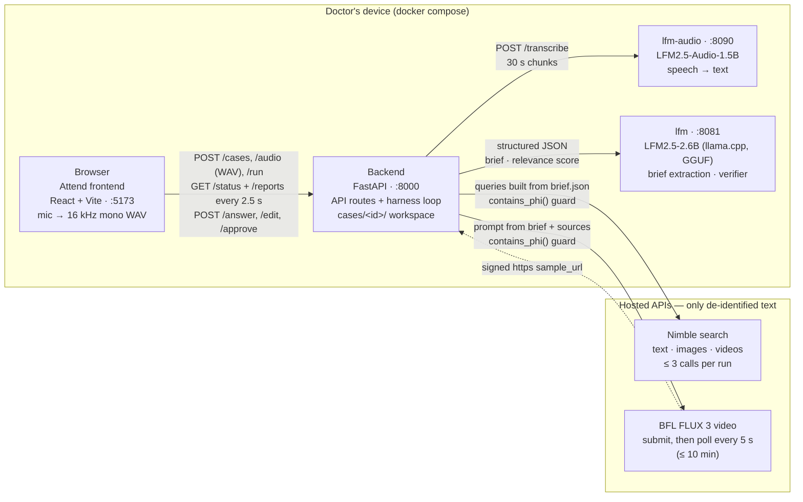
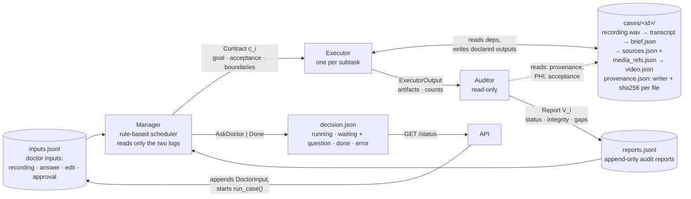
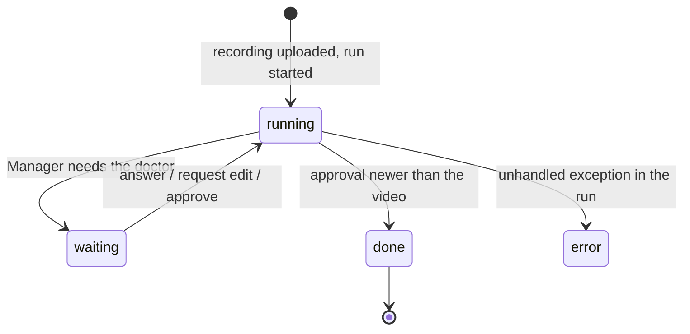

# Architecture

Attend turns a doctor's spoken description of a procedure into a patient-education video. The
work runs on a Manage-Execute-Audit harness (see [ADR 0004](adr/)): a rule-based Manager issues
one contract per round, an executor fulfils it, a read-only Auditor grades the result, and the
report goes into an append-only log that drives the next round. Everything that can contain PHI
stays on the doctor's device; only de-identified text reaches the hosted search and video APIs.

## 1. Components and what crosses each boundary

The Vite dev server proxies `/api` to the backend. `LFM_BASE_URL` and `LFM_AUDIO_BASE_URL` point the
backend at the two model containers; without them the clients load the models in-process. The
recording, transcript and brief never leave the device. Every outbound Nimble query and BFL prompt
passes `phi.contains_phi()` first; a hit is recorded as an audit violation, not sent.

## 2. One harness round

`run_case()` rebuilds the task state from the two logs every round, so nothing is held in memory
between rounds. Round numbers count across runs and `max_rounds` (30) caps a case. The loop stops
when the Manager returns `AskDoctor` (the UI shows the question or the approval gate) or `Done`;
each doctor input appended through the API starts a new run.

Invariants the diagram encodes:

- The Manager never reads the workspace, only reports and doctor inputs.
- The Auditor is read-only. It checks that every artifact an executor claims was written by that
  executor (provenance), that no PHI escaped, and the contract's acceptance criteria.
- Only executors write to the workspace, and only their declared outputs. Writing anything else
  makes the report `suspect`.

## 3. The subtasks, in fixed order

| Subtask | Executor | Runs on | Reads | Writes | Audit check |
|---|---|---|---|---|---|
| `transcribe` | `transcription` | lfm-audio (device) | `audio/recording.wav` | `transcript.txt`, `transcript.json` | no empty or truncated segments; 0.8–6.0 words per voiced second |
| `deidentify` | `deidentify` | rule scrub + lfm (device) | `transcript.txt` | `brief.json` (procedure, steps, patient_concerns, visual_requests) | `phi_remaining == 0`; brief came from the LFM, not the rules-only fallback |
| `research` | `web_search` | Nimble (hosted) | `brief.json`, gaps from earlier reports | `sources.json`, `media_refs.json` | verifier (lfm) scores relevance 1–10: ≥ 8 → complete; contradiction → blocked; else incomplete with the missing evidence as gaps |
| `video` | `video_generation` | BFL FLUX 3 (hosted) | `brief.json`, `sources.json`, `media_refs.json`, the research verdict | `video.json` | status `Ready` with an https `sample_url`; prompt blocked for PHI → violation |

Each subtask depends on the one before it. A subtask becomes *fresh* when its latest report is
`complete`; it becomes *stale* again when a dependency is regenerated or the doctor edits it, which
is how "request edit" on the video reruns only the video step. Media references are prompt-writing
input only and never appear in the output video.

## 4. What the Manager does with a report

| Latest report | Attempts left | Next decision |
|---|---|---|
| none yet | — | issue the contract |
| `integrity = suspect` | yes | retry with the boundary "write only your declared outputs" |
| `status = blocked` | — | `AskDoctor(conflict)` with the Auditor's question; a doctor answer unblocks one retry |
| `status = incomplete` | yes | retry with each gap added as an acceptance criterion |
| any of the above | no | `AskDoctor(retries_exhausted)`; a doctor answer allows one more attempt |
| all four `complete` | — | `AskDoctor(approval)`; an approval newer than the video report → `Done` |

Budgets: `max_attempts = 2` per subtask, `max_research_iterations = 3` for research. Research that
exhausts its attempts is accepted with its gaps, and the video contract carries them forward as
"do not invent content" boundaries. Doctor edits and answers travel the same way, as contract
boundaries, so they survive regeneration.

## 5. What the doctor sees

`decision.json` holds this state per case. The frontend polls `/status` and `/reports` every 2.5 s
while `running`, shows the transcript once the transcribe report is `complete`, and fetches the
video when the state is `waiting` with `kind = approval`.

## Layout

| Path | Role |
|---|---|
| `backend/app/api/routes.py` | HTTP endpoints; `_run()` writes `decision.json` when a run stops |
| `backend/app/harness/` | `loop.py` (round driver), `manager.py`, `state.py` (fresh/stale rebuild), `auditor.py`, `contracts.py` (templates) |
| `backend/app/agents/` | one executor per file, all implementing `Executor` from `base.py` |
| `backend/app/clients/` | `lfm.py`, `lfm_audio.py`, `nimble.py`, `bfl.py` |
| `backend/app/state/` | schemas, `ReportLog`, `InputLog`, `Workspace` |
| `backend/app/phi.py` | `scrub()` and `contains_phi()`, the outbound PHI guard |
| `frontend/src/components/TalkCard.tsx`, `HarnessPanel.tsx` | recording, polling, and the doctor gates |
| `docker-compose.yml` | `frontend`, `backend`, `lfm`, `lfm-audio` |
